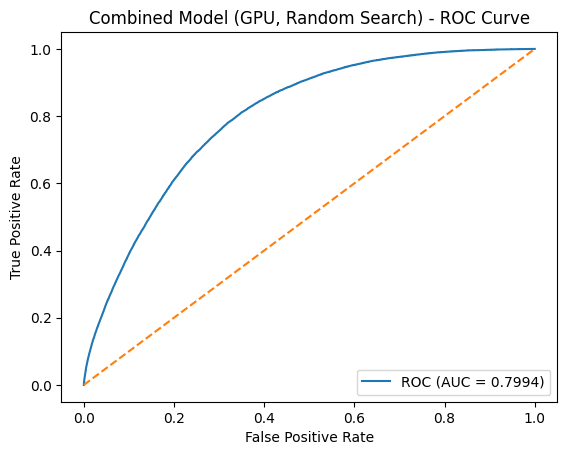
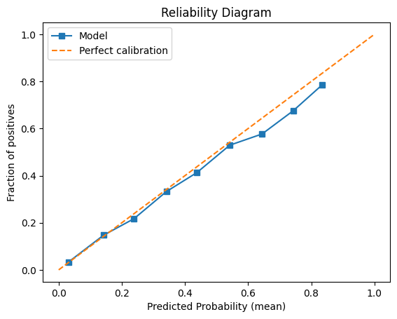

# Hockey Expected Goals (xG) Pipeline

A fully‑featured, GPU‑accelerated Python pipeline for estimating shot‑level expected goals (xG) in ice hockey.
This repository exposes the entire workflow—**raw event data → engineered features → hyper‑parameter‑tuned model → evaluation plots**—so that students and researchers can reproduce results and propose improvements with minimal setup.

---

## ✨ What’s inside?

| Path | Purpose |
|------|---------|
| `pipeline.ipynb` | Main notebook: data load → preprocessing → feature engineering → random XGBoost GPU search → evaluation & plots |
| `data/xg_table.csv.gz` *(compressed)* | Stand‑alone shot‑event table (one row per shot). 100 × smaller than raw CSV; pandas reads it natively. |
| `xgb_combined_gpu_random.pkl` | Fitted XGBoost classifier (best hyper‑params from 20‑trial search). |
| `plots/` | Auto‑generated ROC curve, **Brier score**, and feature‑importance charts. | | Auto‑generated ROC curve, feature‑importance bar chart, and reliability diagram. |
| `requirements.txt` / `environment.yml` | Exact Python dependencies (CUDA‑ready). |
| `LICENSE` | MIT—do what you like, just keep attribution. |

> **Note**  If you want to regenerate the compressed dataset from your own database, see `scripts/export_xg_table.py`.

---

## 🏄‍♂️ Quick start

```bash
# 1. Clone & enter
git clone https://github.com/your-org/hockey-xg-pipeline.git
cd hockey-xg-pipeline

# 2. (Recommended) create conda env with GPU‑enabled XGBoost
conda env create -f environment.yml
conda activate hockey-xg

# 3. Run the notebook OR execute end‑to‑end via nbconvert
jupyter lab                 # interactive
# OR non‑interactive:
jupyter nbconvert --to notebook --execute pipeline.ipynb --output executed.ipynb
```

> **GPU note** The notebook defaults to `tree_method="gpu_hist"`. On CPU‑only hardware set `USE_GPU = False` in the first cell—execution will just be slower.

---

## 🔬 Pipeline walkthrough

1. **Data ingestion** – `pd.read_csv('data/xg_table.csv.gz', compression='gzip')` loads ~2 M shots in <15 s on a laptop.  
   *(If you have more efficient formats—Parquet, Feather—just swap the loader.)*
2. **Season filter** – Drops pre‑2013‑14 seasons to reduce rink‑layout noise.
3. **Hold‑out split** – Seasons 2022‑23 → 2024‑25 are reserved for final testing (time‑based, no leakage).
4. **Geometry cleaning** – `clean_and_calculate_coords()` mirrors shots to a single net, removes outliers, and calculates distance/angle.
5. **Context features** – `add_prior_event_features()` derives time/distance delta to the previous event, movement vectors, game‑state buckets, and strength situations.
6. **Feature matrix** – `build_feature_matrix()` adds polynomial terms, interaction terms, distance bins, a “slot” indicator, and one‑hot encodes categoricals.
7. **Random search** – `random_search_xgb_gpu()` performs a 20‑trial hyper‑parameter exploration with 4‑fold Stratified CV, scoring on **log‑loss**.
8. **Final fit** – Winning parameters are refit on the full training set; the model is pickled to `models/`.
9. **Evaluation** – Notebook renders ROC AUC, feature importance rankings, and a reliability diagram for calibration diagnostics.

Everything happens inside **one notebook** so nothing is hidden.

---

## 🏒 Model specifics & results

### Feature set (35 – 45 columns)

| Group | Examples | Rationale |
|-------|----------|-----------|
| **Geometry** | `shot_distance_calc`, `shot_angle_calc`, `distance_sq`, `angle_sq`, `dist_x_angle` | Core physics of shooting. |
| **Context / Flow** | `time_since_last_event`, `distance_from_last_event`, `delta_x/y`, `movement_speed`, `time_fraction`, `period` | Captures rush chances, rebounds, fatigue, and game clock. |
| **Spatial zones** | `in_slot`, `home_plate`, `behind_net`, `radial_distance`, binned distance (`dist_bin`) | Encodes high-danger areas per coaching guidelines. |
| **Game state** | One-hot score-differential buckets (`down2+`, `down1`, `tie`, `up1`, `up2+`) | Separates desperation shots from settled play. |
| **Shot mechanics** | One-hot `shotType` (wrist, snap, slap, backhand) | Lets the model learn different success rates per technique. |

### Top 10 features by XGBoost gain

| Rank | Feature | Relative importance |
|------|---------|---------------------|
| 1 | **`home_plate`** | 0.195 |
| 2 | `shotType_wrist` | 0.174 |
| 3 | `shotType_snap` | 0.149 |
| 4 | `shotType_slap` | 0.115 |
| 5 | `shotType_backhand` | 0.065 |
| 6 | `distance_sq` | 0.045 |
| 7 | `shot_distance_calc` | 0.043 |
| 8 | `log_distance` | 0.037 |
| 9 | `in_slot` | 0.036 |
| 10 | `time_since_last_event` | 0.020 |

*(Full bar chart in `plots/feature_importance.png`.)*

### Hold-out performance (seasons 2022-23 to 2024-25)

| Metric | Score |
|--------|-------|
| **ROC AUC** | **0.799** |
| Log-loss | 0.416 |
| Brier score | 0.140 |

  
*The model cleanly separates made vs. missed shots (AUC ≈ 0.80).*

  
*Calibration is tight: predictions hug the diagonal, meaning probabilities are well-calibrated.*

---

## 📁 Expected directory layout

```text
.
├── data/
│   └── xg_table.csv.gz
├── plots/
│   ├── brier_score.png
│   ├── feature_importance.png
│   └── roc_curve.png
├── pipeline.ipynb
├── xgb_combined_gpu_random.pkl
├── .gitignore
├── README.md  ← you are here
└── LICENSE
```

---

## 🧑‍💻 Contributing

> **Maintainer approval required** – Direct pushes to `main` are disabled. All changes must arrive as Pull Requests (PRs) and will be merged only after at least one maintainer review and approval.

1. **Fork** this repo and create a branch: `git checkout -b your-feature`.
2. **Update** the notebook or add helper modules (`*.py` scripts welcome—keep paths tidy).
3. **Run the full notebook** to ensure it still executes end‑to‑end.
4. **Commit & push**, then open a **PR**. Attach the executed notebook and any tests.

Once a maintainer reviews and approves the PR, it will be squashed & merged into `main`.

**Idea starters**
- Optuna / Bayesian hyper‑parameter search 🔍
- Goalie fatigue or rebound‑context features
- SHAP explainability dashboard
- Probability calibration (`CalibratedClassifierCV`)
- Model card & data sheet for transparency

---

 📜 License

Released under the **MIT License**—see `LICENSE` for details.  
Feel free to remix, but keep a link to the original repo.

---

## 🙏 Acknowledgements

- **`nhlapi.com`** for the raw play‑by‑play feed.  
- **`xgboost`**, **`scikit‑learn`**, and **`imbalanced‑learn`** for the heavy lifting.  
- Graduate students in the U of T Hockey Analytics course (2025 cohort) for beta testing.

Enjoy firing wrist shots at improving this model—pull requests welcome!

